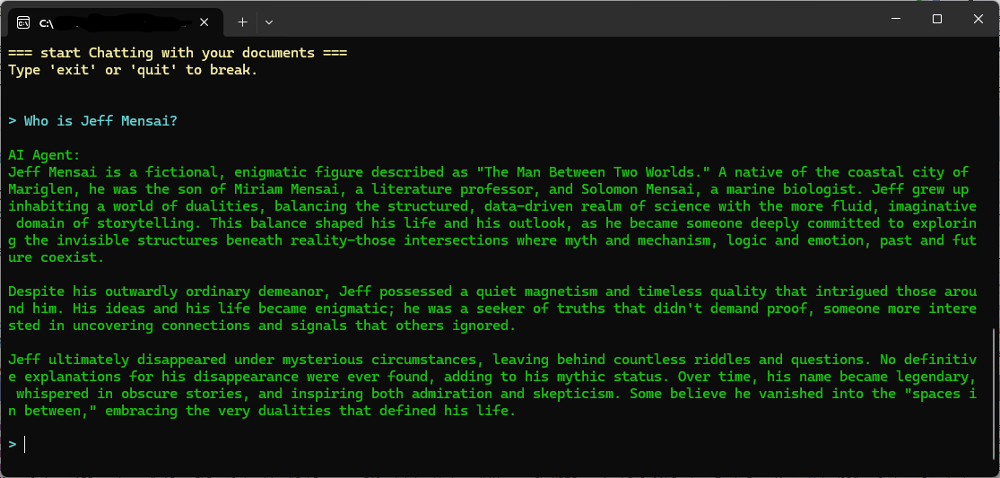

# Demo.MicrosoftSemanticKernel.AzureAISearch

A small RAG System using Microsoft Semantic Kernel and Azure OpenAI Service. 

The RAG system is loaded with test documents from folder "Test Data". 
The test documents contain information about fictitious characters 'Jeff Mensai' and his mother 'Miriam Mensai'.
In the RAG-Chat you can ask questions about them.

## Prerequisites

- .NET 8 SDK
- Visual Studio 2022 or later
- C# 12.0
- Azure OpenAI Service
- Azure AI Search

## Configuration
- Set the following environment variables:
  - `AZURE_OPENAI_ENDPOINT`: The endpoint for the Azure OpenAI service.
  - `AZURE_OPENAI_API_KEY`: The API key for the Azure OpenAI service.
  - `AZURE_OPENAI_DEPLOYMENT`: The deployment name for the Azure OpenAI service.
  - `AZURE_OPENAI_EMBEDDING`: The deployment name for the embedding service (see notes).
  - `AZURE_AISEARCH_API_KEY`: The API key for Azure AI Search.
  - `AZURE_AISEARCH_ENDPOINT`: The Endpoint for Azure AI Search.

## Notes

- At the time when this demo was created, the Semantic Kernel framework seemed to still undergo a lot of changes. Therefore these code examples may not work in future releases of that framework.
- Microsoft Semantic Kernel version 1.49.0 was used for this demo.
- This demo uses pre-release packages as well as alpha-release packages of the Semantic Kernel framework

## License

This project is licensed under the [MIT License](../LICENSE.txt).

   
   